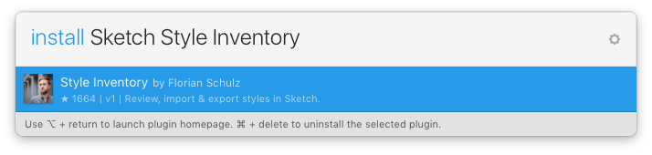

*****
**Important note:** The plugin has been updated to work with Sketch 49
*****

# Style Inventory for Sketch

Design requires free, sometimes chaotic exploration. But design also means organization and structure. Sketch can be good in both aspects, but moving from exploration to structured layouts with text styles and unified colors is hard. Either you start clean files from scratch, or you use what you have and try to tidy it up. The Style Inventory is meant to help you with that. It gives you an overview of all your used styles and helps you to merge styles of similar layers into one.

## Plugin Directory

#### Inventory
* Generate `ctrl` + `⌘` + `⌥` + `I`
* Import Colors
* Name Color Swatch

#### Selection
* by Color/Select Layers by Color `shift` + `ctrl` + `⌘` + `C`
* by Color/Select Layers by Color on Artboard `ctrl` + `⌘` + `C`
* by Name/Select Layers by Name `shift` + `ctrl` + `⌘` + `N`
* by Name/Select Layers by Name on Artboard `ctrl` + `⌘` + `N`
* by String/Replace String `shift` + `⌘` + `K`
* by Text Style/Select Similar Text Layers `shift` + `ctrl` + `⌘` + `T`
* by Text Style/Select Similar Text Layers on Artboard `⌘` + `control` + `T`

## Installation

To install all plugins, [download](https://github.com/getflourish/Sketch-Style-Inventory/archive/master.zip) and double click.

## Install with Sketch Runner
With Sketch Runner, just go to the `install` command and search for `Sketch Style Inventory`. Runner allows you to manage plugins and do much more to speed up your workflow in Sketch. [Download Runner here](http://www.sketchrunner.com).

## Keyboard Shortcuts

You can change keyboard shortcuts using [Sketch Plugin Monster](https://github.com/PeachScript/sketch-plugin-monster), the native System Preferences, or by editing the `manifest.json`

## Style Inventory
Generate a visual style sheet with all colors, text styles and symbols that you are using. This will help you to get an overview of your used styles so you can merge styles that are very similar.

Choose what you want to generate in the configurator. The inventory will be generated on a new page called "Style Inventory".

**Shortcut:** `ctrl` + `⌘` + `⌥` + `I`

## Name Color Swatch
If you want to organize your colors, you can name color swatches (groups) on the color inventory artboard. The plugin uses the following naming convention for palettes and colors:

Colors as part of a palette:

- `Brand > Primary`
- `Grays > 80`

A single color, not part of a palette:

- `Some Color`

You can rename the generated color swatches, or use the plugin that will show a dialog where you can enter the color name.

### Export

When you select this option in the generator, Sketch will export the Style Inventory.

- Colors and palettes as JSON
- Text Styles as CSS
- Symbols as PNG

**Shortcut:** `ctrl` + `⌘` + `⌥` + `I`

### Select Layers by Color

Based on a selected layer, all layers that match the fill or text color will be selected.

**Shortcut:** `ctrl` + `⌘` + `C`

### Select Layers by Text Style

Based on a selected layer, all layers that match its text style will be selected.

**Shortcut:** `ctrl` + `⌘` + `T`

### Select Layers by Name

Based on a selected layer, all layers that match the name of the reference layer will be selected. This will also include layers that have appended numbers from duplication (e.g. Rectangle 1, Rectangle 2, …)

**Shortcut:** `ctrl` + `⌘` + `N`

### Replace String

Replaces all occurences of the text string found in the selected text layer

**Shortcut:** `shift` + `⌘` + `K`

## Change Log

**April 14, 2018**
* Updated for Sketch 49
* Added support for Sketch Plugin Updater

**February 28, 2016**
* Refactored to new plugin bundle format

**April 26, 2015**
* Added Symbols Inventory
* Simplified export
* Added configurator

**April 14, 2015**
* Updated plugins for Sketch 3.3+

**December 7, 2014**
* Moved all unrelated plugins to a new repository called [Sketch Mate](https://github.com/getflourish/Sketch-Mate). It will take a few days to update the documentation for the new plugins.
